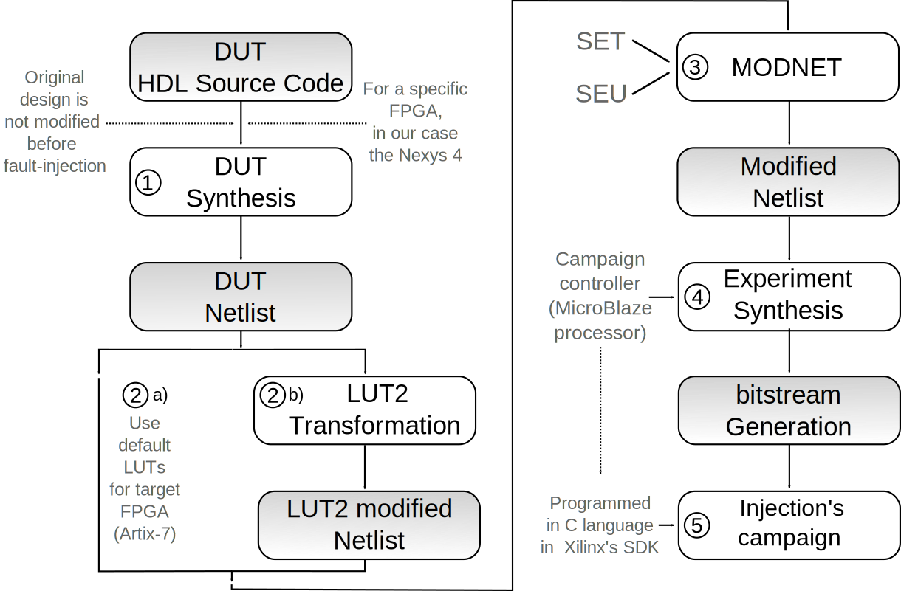
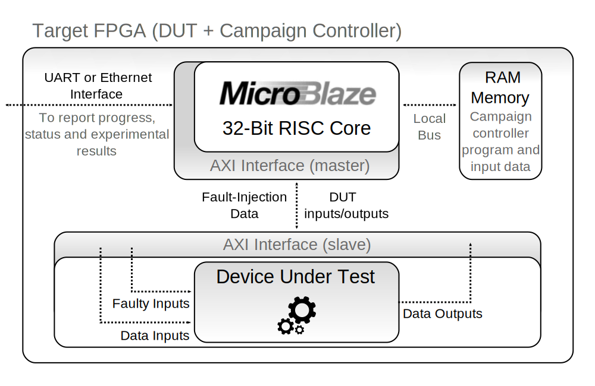

# NetFI2: Netlist Fault Injection system - Version 2

Fault injection is a well-known technique to evaluate the sensitivity of integrated circuits to the effects of radiation. In this work, an existing emulation-based methodology is extended, updated and improved under the name of NETFI-2. Unlike previous solutions, NETFI-2 allows for unprecedented hardware resources efficiency, campaign flexibility, and highly accurate error rate estimation. This is achieved by a dedicated embedded campaign controller in charge of injecting Single Event Upsets (SEUs) and Single Event Transients (SETs) in sequential and combinatorial blocks with configurable granularity. Extensive experiments performed on a stochastic Bayesian machine case study are presented to demonstrate NETFI-2 features and advantages.

## Methodology

<!--  -->

## Architecture

